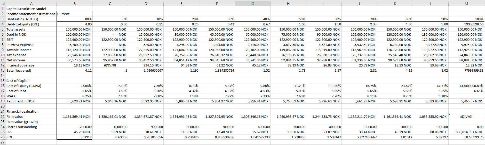
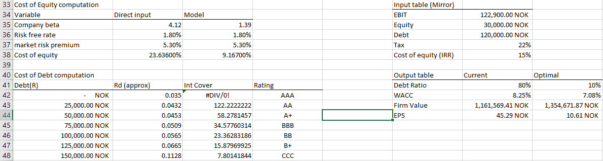
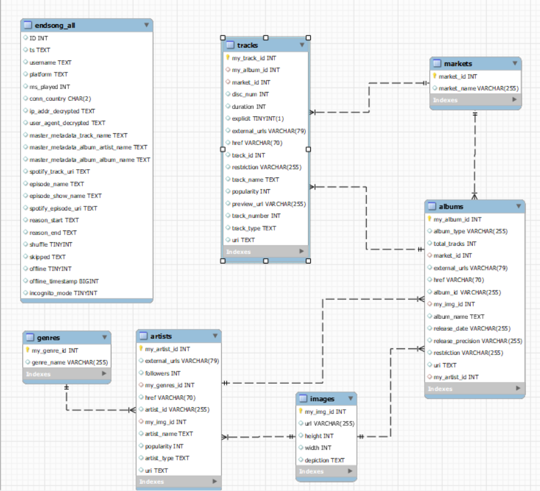
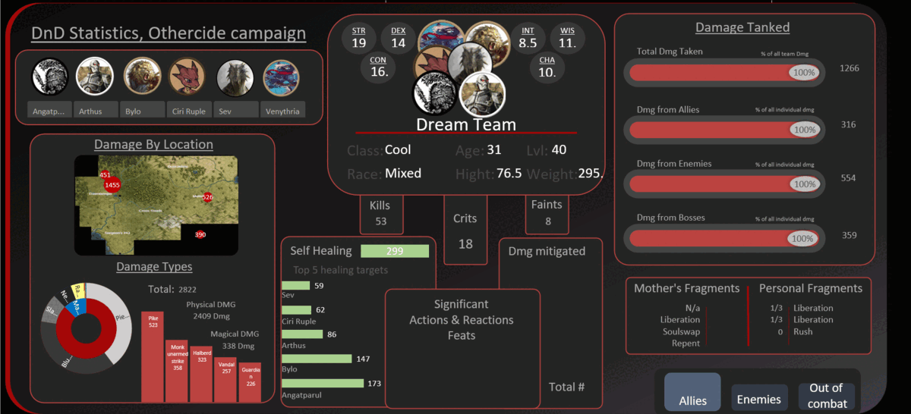

# Hi, my name is Adrian Bratseth and this is my portfolio
I am a 22 year old student from Trondheim Norway who completed his education in Singapore. I am an aspiring data scientist who specializes in finance. I have always loved quantifiable information and the whole process of collecting, sorting and displaying data. I have worked on a variety of self-quantitative projects where I use myself as object of study. These ventures have taught me a great deal about how to utilize statistics and how to leverage the lessons they teach you.  I now seek to develop my analytical skills further, especially withing finance; a subject I have a passionate interest for.

## Project 3: [Financial models]()
### Status: Finished   Last edited: June 2022
In this project i built out an excel capital struckture model that outputs the optimal debt ratio of a company based on its EBIT, cost of debt and cost of equity. it does this by finding the debt ratio where WACC is the lowest combined with the highest firm value. It also allows you to input a company's current debt-to-equity ratio to see the effects of tax on the firm's metrics. it is a automated using standard excel formulas.
### Screen-shots of the model

#### Lessons from the projects
* the effect of tax on a firms valuation
* capital struckture concepts like leverage, bankrupcy costs and liability seniority
* gained an indepth understanding of Miller-Modigliani's therom
* learned about credit scoring as a technique to price debt. 

## Project 2: [Spotify listening data](https://github.com/A-Bratseth/my_music_info)
### Status: work in progress   Last edited: Sep 2022
Spotify listening data is a project where i use python code to query the spotify api to collect data on any spotify artist, album or track i've listened to between 2015-2022. Then place and organize this data into a mysql database also using python. This data was analyzed and presented using pandas and matplot libaries. 
### Database images

#### Lessons from the projects
* have learned error catching and exception handeling and respons loging. 
* Api and database connection with python code
* normalization of database, database preformance (memory) optimization through effective use of datatype

## Project 1: [Dungeons and dragons combat stats dashboard](https://github.com/A-Bratseth/DnD_combat_statistics)
### Status: Abandoned   Last edited: Dec 2021
This is a project where i collect and analyze combat statistics from my two Dnd campaigns. It was started in 2021 but is now been abandoned since the campaign ended befor completion. it was my first ever data science project and it was what opened my eyes to its potential.
it was done 100% in excel where data was inputed manualy during the play. The relevent datapoints are extracted using pivot table then formated and displayed in a dashboard.
### Completed dashboard for campaign: othercide

#### Lessons from the projects
* Excel pivot tables and how to extract data
* Designing tables, and vizualising of data
* Excel formating
